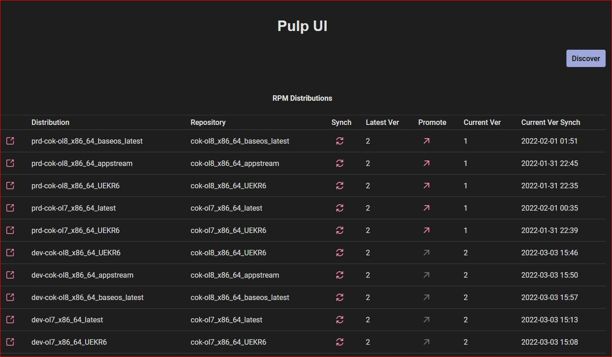

# Pulp RPM distributions viewer

Shows the RPM distributions in a Pulp instance.

Distribution -> Publiciation -> RPM Repo Version -> RPM Repo




## Development

While developing, running the frontend independently will reflect changes dynamically. In this case:

* ensure the backend service is running so it can respond to service calls
* add the location of the backend service to `config.js`
* launch the frontend with:

```
npm run dev
```

* visit the frontend url

## Non-Development

If not developing, a static version of the frontend deployed to the backend server will suffice. Run:

```
npm run build
```

in order to deploy the frontend component as a static resouce to the backend. Then there is no need to launch the frontend. Instead, start the backend server and visit the default url.
